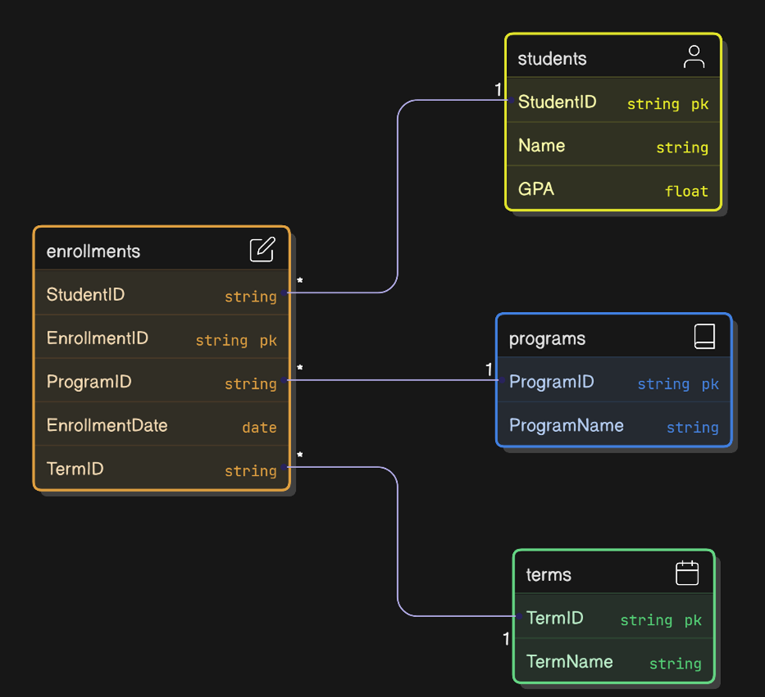

# EduInsight 

## API Endpoints Used
- `GET /` – Home dashboard with enrollment stats and benchmark data.
- `GET /Home/About` – Team profile page.
- `GET /Enrollments` – List of stored enrollments.
- `GET /Enrollments/Create`, `POST /Enrollments/Create` – Add a new enrollment.
- `GET /Enrollments/Update?studentId=`, `POST /Enrollments/UpdateLookup`, `POST /Enrollments/Update` – Edit an existing enrollment.
- `GET /Enrollments/Delete?studentId=`, `POST /Enrollments/DeleteLookup`, `POST /Enrollments/Delete` – Remove an enrollment.
- `GET /Insights/Data` – JSON feed for charts.
- `GET /Bot` – Botpress chat view.
- External: `GET https://api.data.gov/ed/collegescorecard/v1/schools` – College Scorecard benchmark service (API key loaded from configuration).

## Data Model
- Primary entity: `Enrollment` with `StudentId`, `StudentName`, `Program`, `Term`, `Gpa`, and `EnrollmentDate`.
- View models: `EnrollmentFormModel`, `EnrollmentDeleteModel`, `HomeDashboardViewModel`, `DataInsightsViewModel`, `BenchmarkSummary`.
- Data stored in `Data/enrollments.json`, seeded from `wwwroot/data/enrollments.csv`.
- Updated ERD: 

## CRUD Implementation Overview
- **Create:** `EnrollmentsController.Create` saves validated form data through `EnrollmentRepository.AddAsync`.
- **Read:** `EnrollmentsController.Index`, `HomeController.Index`, and `InsightsController.Data` call `EnrollmentRepository.GetAllAsync`.
- **Update:** `EnrollmentsController.Update` loads records, checks for duplicate IDs, then writes changes via `EnrollmentRepository.UpdateAsync`.
- **Delete:** `EnrollmentsController.Delete` confirms intent and removes records through `EnrollmentRepository.DeleteAsync`.

## Technical Challenges and Solutions
- **Persistence in Azure:** Repository checks for `HOME/site/data` so JSON storage works after deployment.
- **Data seeding:** CSV import runs once and normalizes GPA and date values before writing JSON.
- **API reliability:** `CollegeScorecardService` logs failed calls and returns an empty `BenchmarkSummary` when the API is unavailable.
